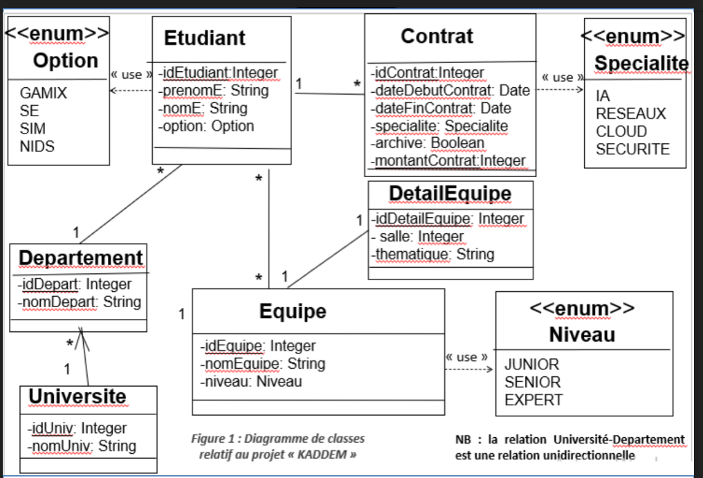
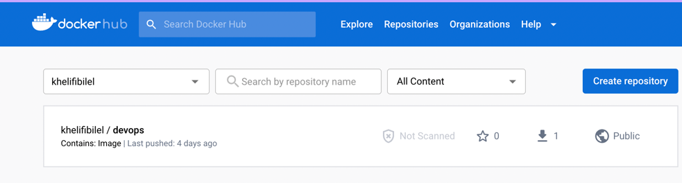

# Projet DevOps CI/CD
Ce projet est un exemple de l'utilisation de Jenkins, SonarQube, Maven et Docker pour automatiser la développement, le test et le déploiement d'une application Spring Boot.

Le projet consiste en 2 machines virtuelles dans le cloud, azure, la première pour configurer jenkins et sonarqube et l'autre pour le déploiement du backend et de la base mysql d'une façon complètement automatisée.

Toute modification du code suivie d'un push dans le github va lancer le pipeline CI/CD avec l'utilisation de webhook dans la configuration du répo github.
Le diagramme de classe de la bade de données:

### Prérequis
Installez Jenkins, SonarQube et Docker et Maven sur la machine virtuelle Azure.

#### Configuration de Jenkins
- On ouvre Jenkins et créez un nouveau projet pipeline.
- Dans la configuration du pipeline, on spécifie le dépôt de code source de l'application: qui est pour notre cas le lien du répo github.
- Une étape de construction pour compiler et tester l'application.
- Une étape de construction pour exécuter une analyse de la qualité du code à l'aide de SonarQube.
- Une étape pour déployer l'application dans un conteneur Docker.
#### Configuration de SonarQube
* Dans la configuration du pipeline Jenkins, on ajoute une étape pour analyser le code à l'aide de SonarQube, des test de qualité.
#### Configuration de Docker
* On construit une image Docker lancer application en utilisant le Dockerfile.

#### Dockerfile :
* Pour la création  d'une image docker artefact .
* Le contenu du backend est compilé et archivé dans un artefact JAR avec RUN: **mvn clean package -Dmaven.test.skip=true**
  et qui sera dans copié l'image docker avec: **COPY --from=builder /app/source/target/*.jar /app/app.jar**

##### script.groovy :
* Un script dans lequel sont définies toutes les fonctions nécessaires au processus de CI/CD.
  Ce script va être chargé dans le Jenkinsfile afin que le script lui-même ait accès aux variables d'environnement définies dans le Jenkinsfile.

##### Jenkinsfile :
C'est le fichier dans lequel nous définissons les étapes de notre processus de CI/CD.
* La première étape 'init' est utilisée pour charger le script groovy dans la variable gv.
* La deuxième étape est responsable du test du code avec Sonarqube.
* L'étape build est responsable de la construction de l'image Docker basée sur le Dockerfile et de la charger vers le dépôt Dockerhub.
* Enfin, l'étape de déploiement qui nous permet de nous connecter en SSH au serveur de déploiement et d'exécuter le fichier Docker-compose pour lancer les 2 containers de la deuxième machine virtuelle.

##### Docker-compose.yaml :

* Responsable du lancement du backend et de la base de données mysql, qui est pour le moment vide, dans une machine virtuelle de déploiement.
* Responsable du téléchargement de l'image docker de l'application springboot depuis dockerhub et de sa création tout en définissant les variables env nécessaires pour chaque service.

Exemple d'image docker contenant l'artefact .jar de l'application, qui est ajouté dans dockerhub.

 

